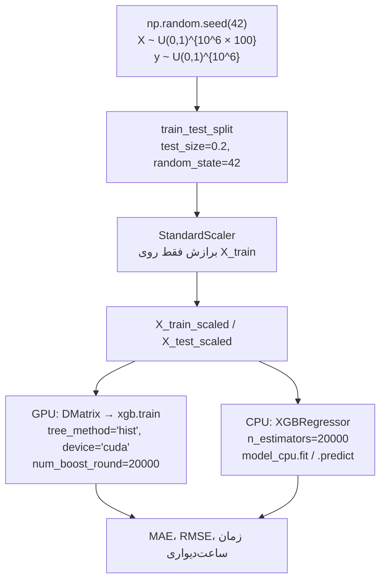

<div dir="rtl">

# XGBoost: مبانی ریاضی و پیاده‌سازی پایتون

**زبان‌ها:** [English](README.md) | فارسی

[](https://www.python.org/)
[](https://xgboost.readthedocs.io/)
[](https://github.com/azomorodian/MLXGB_CPU_GPU)
[](https://github.com/azomorodian/MLXGB_CPU_GPU)

**نویسنده:** [آرتین زمردیان](https://github.com/azomorodian) (Artin Zomorodian) · گیت‌هاب: [`azomorodian`](https://github.com/azomorodian)

**مخزن:** [`azomorodian/MLXGB_CPU_GPU`](https://github.com/azomorodian/MLXGB_CPU_GPU)

**پشتهٔ فنی:** Python · XGBoost · Scikit-Learn · Pandas · NumPy · Matplotlib / Seaborn

---

این مخزن یک سند آموزشی در سطح انتشار علمی دربارهٔ **تقویت گرادیانی افراطی (XGBoost)** است: تابع هدف منظم‌شدهٔ مرتبهٔ دومِ چِن و گِسترین (۲۰۱۶)، معیار حریصانهٔ بهرهٔ انشعاب، و یک خط لولهٔ پایتون با توان عملیاتی بالا برای مقایسهٔ **CPU در برابر GPU (CUDA)**.

آزمایش اجرایی در [`XGBoost_DigitClassifier.py`](XGBoost_DigitClassifier.py) یک **محک رگرسیون نظارت‌شده در مقیاس بزرگ** است (یک میلیون سطر، ۱۰۰ ویژگی، ۲۰٬۰۰۰ دور تقویت). خودِ XGBoost نسبت به تابع زیان خنثی است: همان ماشین درختِ جمع‌پذیر زیربنای `XGBRegressor` و `XGBClassifier` است. بنابراین بخش‌های نظری چارچوب کلی — از جمله مسیر رده‌بندی لجستیک / سافتمکس — را پوشش می‌دهند، در حالی که شرح کد با این مخزن **خط‌به‌خط** مطابقت دارد.

> **یادداشت علمی دربارهٔ نام فایل مبدأ.** اسکریپت به دلایل تاریخی `XGBoost_DigitClassifier.py` نام دارد. پیاده‌سازی فعلی **نه** MNIST (و نه هیچ مجموعهٔ ارقام) را بارگذاری می‌کند و **نه** `XGBClassifier` را فراخوانی می‌کند. ویژگی‌ها و برچسب‌ها از توزیع یکنواخت i.i.d. روی $(0,1)$ نمونه‌گیری می‌شوند؛ یک بوستر GPU با `xgb.train` و یک بوستر CPU با `XGBRegressor` آموزش می‌بینند؛ و **MAE**، **RMSE** و زمان ساعت‌دیواری گزارش می‌شود.

---

## فهرست مطالب

1. [نمای کلی](#1-نمای-کلی)
2. [مبانی نظری و ریاضی XGBoost](#2-مبانی-نظری-و-ریاضی-xgboost)
   - [تقویت درختی گرادیانی در برابر آدا‌بوست و جنگل تصادفی](#21-تقویت-درختی-گرادیانی-در-برابر-آدابوست-و-جنگل-تصادفی)
   - [صورت‌بندی تابع هدف](#22-صورتبندی-تابع-هدف)
   - [بسط تیلور مرتبهٔ دوم](#23-بسط-تیلور-مرتبه-دوم)
   - [وزن بهینهٔ برگ و بهرهٔ انشعاب](#24-وزن-بهینه-برگ-و-بهره-انشعاب)
   - [منظم‌سازی و انقباض](#25-منظمسازی-و-انقباض)
   - [زیان رده‌بندی در برابر رگرسیون](#26-زیان-ردهبندی-در-برابر-رگرسیون)
3. [شرح خط‌به‌خط کد و معماری](#3-شرح-خطبهخط-کد-و-معماری)
4. [ارزیابی مدل و تجسم](#4-ارزیابی-مدل-و-تجسم)
5. [راهنمای شروع و اجرا](#5-راهنمای-شروع-و-اجرا)
6. [مراجع دانشگاهی و کتاب‌شناسی](#6-مراجع-دانشگاهی-و-کتابشناسی)

---

## 1. نمای کلی

این مخزن به‌عنوان یک **اثر آموزشی** طراحی شده است: حل بستهٔ وزن برگ در XGBoost را در کنار یک اسکریپت پایتونِ قابل بازرسی قرار می‌دهد که هم API برآوردگرِ سبکِ sklearn و هم API بومی `DMatrix` / `xgb.train` را روی CUDA تحت فشار قرار می‌دهد.

| مؤلفه | کاری که این مخزن واقعاً انجام می‌دهد |
| --- | --- |
| **مسئلهٔ یادگیری** | **رگرسیون** نظارت‌شده روی دادهٔ جدولی مصنوعی |
| **ماتریس طراحی** | `X = np.random.rand(1_000_000, 100)` — یکنواخت $(0,1)$ با شکل $(n, p) = (10^6, 100)$ |
| **هدف** | `y = np.random.rand(1_000_000)` — **مستقل** از `X` نمونه‌گیری شده (نوفهٔ خالص؛ بنگرید به §۴) |
| **تقسیم** | `train_test_split(..., test_size=0.2, random_state=42)` → ۸۰۰٬۰۰۰ / ۲۰۰٬۰۰۰ |
| **پیش‌پردازش** | `StandardScaler` فقط روی تاخوردگی آموزش برازش می‌شود |
| **مسیر GPU** | `xgb.DMatrix` + `xgb.train(params_gpu, ..., num_boost_round=20000)` با `tree_method='hist'` و `device='cuda'` |
| **مسیر CPU** | `XGBRegressor(n_estimators=20000)` به‌همراه `.fit` / `.predict` |
| **معیارها** | زمان آموزش / پیش‌بینی، **MAE** آموزش/آزمون، **RMSE** آموزش/آزمون |



**چرا برچسب‌ها سیگنال ندارند.** چون `y` مستقل از `X` نمونه‌گیری می‌شود، پیش‌بین بهینهٔ بیز همان ثابت $\mathbb{E}[y] = 1/2$ است. بنابراین این آزمایش یک **محک سامانه‌ای / توان عملیاتی** است (با چه سرعتی می‌توان ۲۰٬۰۰۰ درخت هیستوگرامی را روی دادهٔ $10^6 \times 100$ رشد داد)، نه مطالعه‌ای دربارهٔ تعمیم به یک هدف ساخت‌یافته. انتظار می‌رود MAE آزمون نزدیک خطای کاهش‌ناپذیرِ یکنواخت $(0,1)$ بماند، در حالی که خطای آموزش می‌تواند با حفظ کردن نوفه به صفر نزدیک شود — نمایش زندهٔ **بیش‌برازش** تحت `n_estimators` بیش از حد بزرگ.

---

## 2. مبانی نظری و ریاضی XGBoost

XGBoost (eXtreme Gradient Boosting) یک الگوریتم **درخت جمع‌پذیر حریصانه، مرتبهٔ دوم و منظم‌شده** است. ماشین تقویت گرادیانیِ فریدمن (۲۰۰۱) را با سه ارتقای آماری و مهندسی پیاده می‌کند که آن را به یادگیرندهٔ پیش‌فرض دادهٔ جدولی دههٔ ۲۰۱۰ تبدیل کرد:

1. **بسط مرتبهٔ دوم (نیوتن)** از تابع زیان، طوری که هر درخت یک تقریب درجهٔ دوم را برازش می‌دهد نه یک شبه‌باقیماندهٔ مرتبهٔ اول را.
2. یک **جریمهٔ صریح پیچیدگی** $\Omega(f)$ روی تعداد برگ‌ها و نرم $\ell_2$ (و اختیاری $\ell_1$) وزن‌های برگ.
3. بهینه‌سازی‌های سامانه‌ای — سطل‌بندی هیستوگرام (`hist`)، یافتن انشعاب آگاه از تنکی، چیدمان بلوکیِ سازگار با کش، و در این مخزن **آموزش روی دستگاه CUDA**.

### 2.1 تقویت درختی گرادیانی در برابر آدا‌بوست و جنگل تصادفی

روش‌های همادی در *چگونگی* کاهش خطا فرق دارند. راسل و نورویگ این موضوع را به‌صورت جست‌وجو در فضای فرضیه صورت‌بندی می‌کنند: بسته‌بندی (بگینگ) *به‌صورت موازی* با تصادفی‌سازی مجموعهٔ آموزش فضا را می‌کاود؛ تقویت *به‌صورت ترتیبی* با وزن‌دهی مجدد باقیماندهٔ کمیتهٔ جاری پیش می‌رود.

| | **جنگل تصادفی** (بسته‌بندی) | **آدا‌بوست** (تقویت مرتبهٔ اول) | **XGBoost / GBM** (نزول گرادیان تابعی) |
| --- | --- | --- | --- |
| **ترکیب فرضیه‌ها** | میانگین (یا رأی) درختان عمیق و مستقل | رأی وزن‌دار کُنده‌های ضعیف؛ وزن نمونه $w_i \propto \exp(-y_i F(x_i))$ | مدل جمع‌پذیر $F_T(x) = \sum_{t=1}^{T} \eta f_t(x)$؛ هر $f_t$ یک CART است |
| **چه چیزی بهینه می‌شود** | واریانس درختان پروردگی (برایمن) | زیان نمایی $\sum_i \exp(-y_i F(x_i))$ | زیان دوبار مشتق‌پذیر دلخواه $l(y, \hat{y})$ به‌علاوهٔ $\Omega(f)$ |
| **سیگنال باقیمانده** | هیچ — درختان مشروط به نوفهٔ بوت‌استرپ/ویژگی i.i.d. هستند | نقاط بدرده‌بندی‌شده *وزن نمونه* بزرگ‌تری می‌گیرند | هر درخت روی **گرادیان‌ها** $g_i$ (و **هسین‌ها** $h_i$) زیان جاری برازش می‌شود |
| **منظم‌سازی** | عمق، `min_samples_leaf`، بسته‌بندی ویژگی | تعداد دورها؛ حساس به نوفه | $\gamma, \lambda, \alpha$، انقباض $\eta$، زیرنمونه‌گیری سطر/ستون، حداکثر عمق |
| **موازی‌سازی** | کاملاً موازی روی درختان | ترتیبی روی دورها | ترتیبی روی دورها؛ **موازی روی ویژگی‌ها / سطل‌های هیستوگرام** (و GPU) |

**آدا‌بوست** تقویت با زیان نمایی و گام مرتبهٔ اول (گرادیان) است. **جنگل تصادفی** واریانس را با ناهمبسته‌کردن درختان کاهش می‌دهد؛ به تورش به‌صورت ترتیبی حمله نمی‌کند. **XGBoost** گام‌های نیوتن را در فضای تابع برمی‌دارد: معیار انشعاب کاهش دقیق *تابع هدف منظم‌شدهٔ مرتبهٔ دوم* است، نه جینی یا آنتروپی. به همین دلیل پیکربندی نوعی XGBoost یک درخت کم‌عمق (`max_depth` برابر ۳ تا ۸) به‌همراه دورهای زیاد (`n_estimators` در حد صدها) است، در حالی که جنگل تصادفی درختان عمیق‌تر و بدون انقباض را ترجیح می‌دهد.

مدل جمع‌پذیر در تکرار $t$ عبارت است از

$$
\hat{y}_i^{(t)} = \hat{y}_i^{(t-1)} + \eta f_t(x_i), \qquad f_t \in \mathcal{F},
$$

که $\mathcal{F}$ فضای درختان رگرسیون و $\eta$ عامل نرخ یادگیری / انقباض است (پیش‌فرض $0.3$ در XGBoost؛ بنگرید به §۲.۵).

### 2.2 صورت‌بندی تابع هدف

فرض کنید $\{(x_i, y_i)\}_{i=1}^{n}$ نمونهٔ آموزش باشد. چِن و گِسترین (۲۰۱۶) **تابع هدف منظم‌شده در دور تقویت $t$** را چنین می‌نویسند:

$$
\mathcal{L}^{(t)} = \sum_{i=1}^{n} l\!\left(y_i,\; \hat{y}_i^{(t-1)} + f_t(x_i)\right) + \Omega(f_t),
$$

با منظم‌ساز پیچیدگی درخت

$$
\Omega(f) = \gamma T + \frac{1}{2}\lambda \sum_{j=1}^{T} w_j^2.
$$

**نمادگذاری.**

| نماد | معنا در این مخزن |
| --- | --- |
| $l(\cdot,\cdot)$ | زیان هر نمونه. پیش‌فرض برای `XGBRegressor` / `xgb.train` بدون `objective` برابر **خطای مربعی** است |
| $\hat{y}_i^{(t-1)}$ | امتیاز همادی *پیش از* درخت $t$ (حاشیه / پیش‌بینی خام) |
| $f_t$ | درختی که در دور $t$ افزوده می‌شود: افراز $q:\mathbb{R}^p\to\{1,\ldots,T\}$ و وزن‌های برگ $w \in \mathbb{R}^{T}$ |
| $T$ | تعداد **برگ‌ها** (نه دورهای تقویت). در کد، `num_boost_round` / `n_estimators` تعداد *درختان* است |
| $\gamma$ | حداقل کاهش زیان لازم برای ایجاد انشعاب (`gamma` در API اسکیت‌لرن) |
| $\lambda$ | جریمهٔ $\ell_2$ روی وزن برگ (`reg_lambda`؛ پیش‌فرض $1$) |
| $w_j$ | وزن (پیش‌بینی) برگ $j$ |

یک جملهٔ اختیاری $\ell_1$ به شکل $\alpha \sum_j |w_j|$ (`reg_alpha`) وزن برگ را آستانه‌گذاری نرم می‌کند، مشابه لاسو. این اسکریپت `reg_alpha` را تنظیم نمی‌کند؛ بنابراین همان صورت $\ell_2$ بالا واقعاً بهینه می‌شود.

### 2.3 بسط تیلور مرتبهٔ دوم

زیان عموماً تابعی غیرخطی از $f_t(x_i)$ است. XGBoost آن را با **چندجمله‌ای تیلور مرتبهٔ دوم** نسبت به نمو $f_t(x_i)$، محاسبه‌شده در پیش‌بینی جاری $\hat{y}_i^{(t-1)}$، جایگزین می‌کند:

$$
l\!\left(y_i,\; \hat{y}_i^{(t-1)} + f_t(x_i)\right)
\;\approx\;
l\!\left(y_i,\; \hat{y}_i^{(t-1)}\right)
\;+\;
g_i\, f_t(x_i)
\;+\;
\frac{1}{2}\, h_i\, f_t(x_i)^2.
$$

**گرادیان مرتبهٔ اول** و **هسین مرتبهٔ دوم** (نسبت به *پیش‌بینی*، نه پارامترها) عبارتند از

$$
g_i = \frac{\partial l(y_i, \hat{y}_i^{(t-1)})}{\partial \hat{y}_i^{(t-1)}}, \qquad
h_i = \frac{\partial^2 l(y_i, \hat{y}_i^{(t-1)})}{\partial (\hat{y}_i^{(t-1)})^2}.
$$

جملهٔ ثابت $\sum_i l(y_i, \hat{y}_i^{(t-1)})$ به $f_t$ وابسته نیست و حذف می‌شود. با جایگذاری $f_t(x) = w_{q(x)}$ و گروه‌بندی نمونه‌ها بر حسب برگ $I_j = \{i : q(x_i) = j\}$، **درجهٔ دومِ جداپذیر روی برگ‌ها** به‌دست می‌آید:

$$
\tilde{\mathcal{L}}^{(t)}(q, w)
=
\sum_{j=1}^{T}
\left[
G_j w_j + \frac{1}{2}\,(H_j + \lambda)\, w_j^2
\right]
+ \gamma T,
$$

که آمارهای کافی برگ $j$ عبارتند از

$$
G_j = \sum_{i \in I_j} g_i, \qquad H_j = \sum_{i \in I_j} h_i.
$$

به همین دلیل XGBoost یک **روش نیوتن در فضای تابع** است: $G_j$ گرادیان جمع‌شده، $H_j$ انحنای جمع‌شده، و $\lambda$ جملهٔ میرایی ریج است که گام نیوتن را وقتی $H_j$ کوچک است خوش‌وضع نگه می‌دارد (وضعیتی رایج در زیان لجستیک، جایی که $h_i = p_i(1-p_i)$ برای پیش‌بینی‌های مطمئن صفر می‌شود).

**هسین‌های محاسبه‌شده برای دو زیان متعارف.**

- **خطای مربعی** (تابع هدف ضمنی این مخزن):
  $l = \tfrac{1}{2}(y_i - \hat{y}_i)^2$ می‌دهد $g_i = \hat{y}_i - y_i$ و $h_i = 1$. هر نمونه انحنای یکسان دارد؛ $H_j = |I_j|$.
- **لجستیک / لگاریتم‌زیان دودویی** (`XGBClassifier`، `objective='binary:logistic'`):
  $p_i = \sigma(\hat{y}_i)$، $g_i = p_i - y_i$، $h_i = p_i(1-p_i)$.
- **سافتمکس چندکلاسه** (`objective='multi:softprob'`): در هر دور **یک درخت به‌ازای هر کلاس** رشد می‌کند؛ گرادیان‌ها $p_{i,k} - \mathbb{1}[y_i=k]$ هستند.

### 2.4 وزن بهینهٔ برگ و بهرهٔ انشعاب

برای یک ساختار درخت *ثابت* $q$، تابع $\tilde{\mathcal{L}}^{(t)}$ نسبت به هر $w_j$ یک درجهٔ دوم اکیداً محدب است (با فرض $H_j + \lambda > 0$). با تکمیل مربع، یا با صفر کردن $\partial/\partial w_j$، **وزن بهینهٔ برگ** به‌دست می‌آید:

$$
w_j^{*} = -\frac{G_j}{H_j + \lambda}.
$$

تفسیر: برگ یک **گام نیوتنِ منظم‌شده با ریج** را پیش‌بینی می‌کند — منفیِ میانگین گرادیان، مقیاس‌شده با میانگین هسین به‌علاوهٔ $\lambda$. جایگذاری $w_j^{*}$ در تابع هدف **امتیاز ساختار** را می‌دهد:

$$
\tilde{\mathcal{L}}^{(t)}(q)
=
-\frac{1}{2} \sum_{j=1}^{T} \frac{G_j^2}{H_j + \lambda} + \gamma T.
$$

یک انشعاب نامزد که برگ والد را به فرزندان چپ/راست می‌شکند، بر اساس **بهره** (کاهش امتیاز شباهت) پذیرفته می‌شود:

$$
\mathrm{Gain}
=
\frac{1}{2}
\left[
\frac{G_L^2}{H_L+\lambda}
+
\frac{G_R^2}{H_R+\lambda}
-
\frac{(G_L+G_R)^2}{H_L+H_R+\lambda}
\right]
- \gamma.
$$

سه کسر، **امتیازهای شباهت** فرزند چپ، فرزند راست، و والدِ نشکسته هستند. انشعاب فقط اگر $\mathrm{Gain} > 0$ نگه داشته می‌شود؛ یعنی فقط اگر کاهش زیان از جریمهٔ برگ $\gamma$ بیشتر باشد. این دقیقاً نقش ابرپارامتر `gamma` در `XGBClassifier` / `XGBRegressor` است.

در الگوریتم هیستوگرام (`hist`) که اینجا استفاده می‌شود (`tree_method='hist'`)، ویژگی‌ها در سطل‌های گسسته قرار می‌گیرند و بهترین آستانه روی مرز سطل‌ها جست‌وجو می‌شود نه روی هر مقدار یکتا — تقریبی که $n = 10^6$ و `num_boost_round=20000` را از نظر محاسباتی شدنی می‌کند، به‌ویژه روی GPU.

### 2.5 منظم‌سازی و انقباض

کنترل بیش‌برازش در XGBoost **لایه‌لایه** است. دکمه‌های زیر همگی در API اسکیت‌لرن ظاهر می‌شوند؛ این اسکریپت فعلاً فقط تعداد دور و دستگاه GPU را تنظیم می‌کند و بقیه را در پیش‌فرض کتابخانه می‌گذارد.

| سازوکار | نماد / API | نقش |
| --- | --- | --- |
| **انقباض (نرخ یادگیری)** | $\eta$ · `learning_rate` (پیش‌فرض $0.3$) | پس از محاسبهٔ $w_j^{*}$، درخت به‌صورت $\eta f_t$ افزوده می‌شود. $\eta$ کوچک (مثلاً $0.03$ تا $0.1$) با دورهای بیشتر دستور پخت استاندارد در برابر فراجهش گام نیوتن است |
| **$\ell_2$ (ریج) روی برگ‌ها** | $\lambda$ · `reg_lambda` (پیش‌فرض $1$) | مخرج $H_j+\lambda$ را بزرگ می‌کند و $\|w_j^{*}\|$ را به سمت صفر می‌کشد |
| **$\ell_1$ (لاسو) روی برگ‌ها** | $\alpha$ · `reg_alpha` (پیش‌فرض $0$) | $w_j^{*}$ را آستانه‌گذاری نرم می‌کند؛ در مقادیر برگ تنکی ایجاد می‌کند |
| **حداقل بهرهٔ انشعاب** | $\gamma$ · `gamma` (پیش‌فرض $0$) | از Gain کم می‌شود؛ انشعاب‌های از نظر آماری ضعیف را هرس می‌کند |
| **عمق درخت** | `max_depth` (پیش‌فرض $6$) | مرتبهٔ اندرکنش را محدود می‌کند؛ کنترل ظرفیت غالب در کنار $\eta$ |
| **زیرنمونه‌گیری سطری** | `subsample` (پیش‌فرض $1$) | GBM تصادفی: هر دور کسری تصادفی از سطرها را می‌بیند (فریدمن ۲۰۰۲) |
| **زیرنمونه‌گیری ستونی** | `colsample_bytree` / `bylevel` / `bynode` | بسته‌بندی ویژگی به سبک جنگل تصادفی؛ همبستگی ستونی درختان را کم می‌کند |
| **دستگاه هیستوگرام** | `tree_method='hist'`، `device='cuda'` | منظم‌ساز آماری نیست، اما تقریب جست‌وجوی انشعاب و مسیر سخت‌افزاری را عوض می‌کند |

**زیرنمونه‌گیری ستونی** وقتی $p$ بزرگ است یا ویژگی‌ها هم‌خط هستند اهمیت ویژه دارد: هر درخت ناچار می‌شود روی نمایی تصادفی از فضای ویژگی تخصص پیدا کند؛ این یک ابزار کاهش واریانس مشابه `max_features` در جنگل تصادفی است.

**هشدار روش‌شناختی این اسکریپت.** `params_gpu` فقط `tree_method` و `device` را می‌گذارد. `XGBRegressor(n_estimators=20000)` روی CPU نیز `max_depth`، `learning_rate`، `subsample`، `colsample_bytree`، `gamma` و `reg_lambda` را در پیش‌فرض می‌گذارد. بنابراین مقایسهٔ CPU و GPU یک **مقایسهٔ زمان اجرای دو سطح API تحت ابرپارامترهای پیش‌فرض** است، نه یک آزمایش عاملی کامل روی هر منظم‌ساز.

### 2.6 زیان رده‌بندی در برابر رگرسیون

جبر §۲.۲ تا §۲.۴ اصلاً به $y_i \in \{0,1\}$ در برابر $y_i \in \mathbb{R}$ اشاره نمی‌کند. فقط تعریف $g_i$ و $h_i$ عوض می‌شود.

| وظیفه | برآوردگر XGBoost | `objective` نوعی | ارزیابی (بنگرید به §۴) |
| --- | --- | --- | --- |
| **رگرسیون (این مخزن)** | `XGBRegressor` / `xgb.train` | `reg:squarederror` | MAE، RMSE |
| **رده‌بندی دودویی** | `XGBClassifier` | `binary:logistic` | صحت، لگاریتم‌زیان، ROC-AUC، PR-AUC، ماتریس درهم‌ریختگی |
| **چندکلاسه (مثلاً ارقام)** | `XGBClassifier` | `multi:softprob` | صحت، F1 کلان، ماتریس درهم‌ریختگی، AUC یک‌در‌برابر‌بقیه |

برای تبدیل این مخزن به یک رده‌بند واقعی ارقام باید نمونه‌گیری مصنوعی را با یک مجموعهٔ برچسب‌دار جایگزین کرد، `objective='multi:softprob'` را گذاشت، و با `accuracy_score`، `log_loss`، `roc_auc_score` و `classification_report` ارزیابی کرد. ریاضیات تقویت بدون تغییر می‌ماند.

---

## 3. شرح خط‌به‌خط کد و معماری

تمام منطق اجرایی در [`XGBoost_DigitClassifier.py`](XGBoost_DigitClassifier.py) (۷۵ خط) است. [`main.py`](main.py) همان پیش‌نویس پیش‌فرض پای‌چارم (`print_hi('PyCharm')`) است و **جزئی از خط لولهٔ یادگیری نیست**.

### 3.1 واردات (خطوط ۱–۷)

```python
import numpy as np
import pandas as pd
from sklearn.model_selection import train_test_split
from sklearn.preprocessing import StandardScaler
from sklearn.metrics import mean_absolute_error, mean_squared_error
import time
import xgboost as xgb
```

| خط | شیء | نقش |
| --- | --- | --- |
| ۱ | `numpy as np` | تولید دادهٔ مصنوعی و آرایه‌های پشتیبان همهٔ فراخوانی‌های بعدی |
| ۲ | `pandas as pd` | وارد شده اما **هرگز ارجاع داده نمی‌شود**. بی‌ضرر است؛ برای گسترش مبتنی بر DataFrame (ستون‌های نام‌دار، نمودارهای `feature_importances_`) نگه داشته شده |
| ۳ | `train_test_split` | تقسیم نگهداری i.i.d. با بذر ثابت |
| ۴ | `StandardScaler` | نمرهٔ $z$ ستونی: $(x - \hat{\mu}_{\mathrm{train}}) / \hat{\sigma}_{\mathrm{train}}$ |
| ۵ | `mean_absolute_error`، `mean_squared_error` | MAE و RMSE (دومی از طریق `squared=False`) |
| ۶ | `time` | ساعت‌دیواری `time.time()` دور `train` / `fit` / `predict` |
| ۷ | `xgboost as xgb` | API بومی: `xgb.DMatrix`، `xgb.train` |

### 3.2 مجموعهٔ دادهٔ مصنوعی (خطوط ۹–۱۲)

```python
np.random.seed(42)
X = np.random.rand(1000000, 100)
y = np.random.rand(1000000)
```

- `np.random.seed(42)` مولد تصادفی NumPy را قفل می‌کند تا `X`، `y` و (همراه با `random_state=42` در تقسیم‌کننده) افراز آموزش/آزمون تکرارپذیر باشند.
- `X` دارای **۱٬۰۰۰٬۰۰۰ سطر و ۱۰۰ ستون**، i.i.d. یکنواخت $(0,1)$ است. در حافظه این برابر است با $10^6 \times 100 \times 8$ بایت $\approx$ **۸۰۰ مگابایت** برای `float64`، به‌علاوهٔ یک رونوشت دوم پس از مقیاس‌بندی، به‌علاوهٔ سربار DMatrix — برای چند گیگابایت RAM برنامه‌ریزی کنید.
- `y` یک بردار **یک‌بعدی** یکنواخت $(0,1)$ به طول $10^6$ است که **مستقل** از `X` کشیده شده. هیچ $f(X)$ برای بازیابی وجود ندارد؛ هر بهبود خطای آموزش فراتر از پیش‌بین ثابت، حفظ کردن است.

### 3.3 تقسیم آموزش–آزمون (خطوط ۱۴–۱۵)

```python
X_train, X_test, y_train, y_test = train_test_split(X, y, test_size=0.2, random_state=42)
```

- `test_size=0.2` → $|\mathcal{D}_{\mathrm{train}}| = 800{,}000$، $|\mathcal{D}_{\mathrm{test}}| = 200{,}000$.
- `random_state=42` جایگشت را قطعی می‌کند.
- طبقه‌بندی (stratify) نه خواسته شده و نه مناسب است: `y` پیوسته است.

نام متغیرهای پایین‌دست: `X_train`، `X_test`، `y_train`، `y_test`.

### 3.4 مقیاس‌بندی استاندارد (خطوط ۱۷–۲۰)

```python
scaler = StandardScaler()
X_train_scaled = scaler.fit_transform(X_train)
X_test_scaled = scaler.transform(X_test)
```

درختان نسبت به **مقیاس‌بندی یکنوای ستونی ناوردا** هستند؛ بنابراین `StandardScaler` هندسهٔ انشعاب XGBoost را عوض نمی‌کند. با این حال بازهٔ عددی دیده‌شده توسط سازندهٔ هیستوگرام را تغییر می‌دهد و از نظر آموزشی درست است (برازش روی آموزش، تبدیل آزمون — بدون نشت). آرایه‌های مقیاس‌شدهٔ `X_train_scaled` و `X_test_scaled` تنها ماتریس‌های ویژگی هستند که به XGBoost داده می‌شوند.

### 3.5 بوستر GPU: پارامترها، DMatrix، `xgb.train` (خطوط ۲۲–۳۴)

```python
params_gpu = {
    'tree_method': 'hist',
    'device': 'cuda',
}

dtrain_gpu = xgb.DMatrix(X_train_scaled, label=y_train)
dtest_gpu = xgb.DMatrix(X_test_scaled, label=y_test)

start_time = time.time()
model_gpu = xgb.train(params_gpu, dtrain_gpu, num_boost_round=20000)
gpu_train_time = time.time() - start_time
```

| نام | معنا |
| --- | --- |
| `params_gpu` | دیکشنری پارامتر بومی. `'tree_method': 'hist'` یابندهٔ انشعاب هیستوگرام چندکی را انتخاب می‌کند. `'device': 'cuda'` روش **XGBoost ≥ ۲.۰** برای قرار دادن سازندهٔ هیستوگرام روی GPU است (جایگزین نام مستعار قدیمی `gpu_hist`) |
| `dtrain_gpu`، `dtest_gpu` | `xgb.DMatrix` قالب ستونی داخلی XGBoost است (فشرده، سازگار با کش، پس از اولین فراخوانی ساکن GPU). برچسب‌ها با `label=` همراه ماتریس سفر می‌کنند |
| `num_boost_round=20000` | تعداد درختان جمع‌پذیر $T_{\mathrm{boost}}$ — معادل `n_estimators` در اسکیت‌لرن |
| `model_gpu` | یک شیء بومی `Booster`، **نه** یک برآوردگر اسکیت‌لرن |
| `gpu_train_time` | ثانیه‌های ۲۰٬۰۰۰ دور روی CUDA |

**پیش‌نیاز سخت‌افزاری.** `device='cuda'` به GPU انویدیا، درایور CUDA کارآمد، و ساخت XGBoost با پشتیبانی GPU نیاز دارد. روی ماشین فقط‌CPU این بلوک خطا می‌دهد. بنگرید به §۵.

**تابع هدف پیش‌فرض.** چون `params_gpu` مقدار `'objective'` را نمی‌گذارد، XGBoost از `reg:squarederror` استفاده می‌کند. پیش‌بینی‌ها امتیازهای حقیقی‌اند و با معیارهای رگرسیون بعدی سازگارند.

### 3.6 استنتاج و ارزیابی GPU (خطوط ۳۶–۵۱)

```python
start_time = time.time()
train_pred_gpu = model_gpu.predict(dtrain_gpu)
test_pred_gpu = model_gpu.predict(dtest_gpu)
gpu_pred_time = time.time() - start_time

train_mae_gpu = mean_absolute_error(y_train, train_pred_gpu)
test_mae_gpu = mean_absolute_error(y_test, test_pred_gpu)
train_rmse_gpu = mean_squared_error(y_train, train_pred_gpu, squared=False)
test_rmse_gpu = mean_squared_error(y_test, test_pred_gpu, squared=False)
```

- `Booster.predict` روی `DMatrix` یک بردار NumPy از $\hat{y}$ برمی‌گرداند. در مسیر رگرسیون بومی `predict_proba` وجود ندارد؛ آن روش روی `XGBClassifier` است.
- `squared=False` از اسکیت‌لرن RMSE می‌خواهد نه MSE. این کلیدواژه در scikit-learn **کوچک‌تر از ۱.۶** معتبر است؛ نسخه‌های جدیدتر `root_mean_squared_error` را ترجیح می‌دهند. `requirements.txt` این مخزن اسکیت‌لرن را زیر ۱.۶ نگه می‌دارد تا اسکریپت همان‌طور که نوشته شده اجرا شود.
- فیلدهای چاپ‌شده: `gpu_train_time`، `gpu_pred_time`، `train_mae_gpu`، `test_mae_gpu`، `train_rmse_gpu`، `test_rmse_gpu`.

### 3.7 بوستر CPU: `XGBRegressor` (خطوط ۵۳–۷۵)

```python
from xgboost import XGBRegressor
model_cpu = XGBRegressor(n_estimators=20000)

start_time = time.time()
model_cpu.fit(X_train_scaled, y_train)
cpu_train_time = time.time() - start_time

start_time = time.time()
train_pred_cpu = model_cpu.predict(X_train_scaled)
test_pred_cpu = model_cpu.predict(X_test_scaled)
cpu_pred_time = time.time() - start_time
```

این **API برآوردگر سازگار با اسکیت‌لرن** است:

| فراخوانی | نقش |
| --- | --- |
| `XGBRegressor(...)` | نمونه‌سازی. فقط `n_estimators=20000` بازنویسی می‌شود |
| `model_cpu.fit(X_train_scaled, y_train)` | آموزش؛ آرایه‌های NumPy را می‌پذیرد (نیازی به `DMatrix` نیست) |
| `model_cpu.predict(...)` | استنتاج؛ مشابه `Booster.predict` |

ارزیابی آینهٔ بلوک GPU است با `train_mae_cpu`، `test_mae_cpu`، `train_rmse_cpu`، `test_rmse_cpu`، `cpu_train_time` و `cpu_pred_time`.

**انصاف مقایسهٔ CPU/GPU.** دو مسیر *عمداً* دو API عمومی هستند، اما یک آزمایش A/B کاملاً کنترل‌شده نیستند:

1. GPU از `Booster` بومی استفاده می‌کند؛ CPU از پوشش اسکیت‌لرن (سربار پایتون بیشتر در هر فراخوانی، اشغال نخ متفاوت).
2. فقط دیکشنری GPU مقدار `tree_method='hist'` و `device='cuda'` را می‌گذارد. برآوردگر CPU از پیش‌فرض‌های جاری اسکیت‌لرن XGBoost استفاده می‌کند (`hist` در نسخه‌های اخیر، دستگاه CPU).
3. هر دو از ۲۰٬۰۰۰ دور، همان ماتریس‌های مقیاس‌شده، و همان معیارها استفاده می‌کنند — بنابراین **زمان ساعت‌دیواری** تقابل علمی معنادار است.

### 3.8 ابرپارامترهای اصلی (قابل تنظیم؛ اینجا بیشتر پیش‌فرض)

این نام‌ها سطح API اسکیت‌لرن / XGBoost هستند که در هر مطالعهٔ جدی تنظیم می‌کنید. در *این* فایل فقط `n_estimators` / `num_boost_round` و دستگاه GPU تنظیم شده‌اند.

| ابرپارامتر | در این اسکریپت | پیش‌فرض (XGBoost) | اثر |
| --- | --- | --- | --- |
| `n_estimators` / `num_boost_round` | **۲۰۰۰۰** | ۱۰۰ | تعداد درختان $T_{\mathrm{boost}}$. اینجا بسیار بزرگ است؛ محرک اصلی زمان اجرا و بیش‌برازش مجموعهٔ آموزش روی نوفه |
| `max_depth` | تنظیم‌نشده | ۶ | حداکثر عمق درخت؛ مرتبهٔ اندرکنش |
| `learning_rate` ($\eta$) | تنظیم‌نشده | ۰٫۳ | انقباض اعمال‌شده روی هر $f_t$ |
| `subsample` | تنظیم‌نشده | ۱٫۰ | زیرنمونهٔ سطری در هر درخت |
| `colsample_bytree` | تنظیم‌نشده | ۱٫۰ | زیرنمونهٔ ستونی در هر درخت |
| `gamma` ($\gamma$) | تنظیم‌نشده | ۰ | حداقل Gain برای انشعاب |
| `reg_lambda` ($\lambda$) | تنظیم‌نشده | ۱ | جریمهٔ $\ell_2$ برگ |
| `tree_method` | **`'hist'`** (فقط دیکشنری GPU) | `hist` (XGBoost اخیر) | هیستوگرام در برابر حریصِ دقیق |
| `device` | **`'cuda'`** (فقط دیکشنری GPU) | `cpu` | محل هیستوگرام + پیش‌بینی |

یک پیگیری در سطح پژوهش هر دو برآوردگر را در یک دیکشنری `param` یکسان می‌پیچید (`max_depth`، `eta`، `subsample`، `colsample_bytree`، `gamma`، `reg_lambda`) و `early_stopping_rounds` را روی یک `DMatrix` اعتبارسنجی می‌افزاید تا ۲۰٬۰۰۰ دور یک *کران بالا* باشد، نه یک الزام.

---

## 4. ارزیابی مدل و تجسم

### 4.1 معیارهایی که واقعاً محاسبه می‌شوند

اسکریپت هشت عدد کیفیت به‌علاوهٔ چهار زمان چاپ می‌کند.

**میانگین قدرمطلق خطا**

$$
\mathrm{MAE} = \frac{1}{n}\sum_{i=1}^{n} \lvert y_i - \hat{y}_i \rvert
$$

پیاده‌سازی‌شده با `mean_absolute_error(y_*, *_pred_*)`. MAE با همان واحد $y$ است (اینجا بازهٔ واحد) و نسبت به باقیمانده‌های بزرگ مقاوم است.

**ریشهٔ میانگین مربعات خطا**

$$
\mathrm{RMSE} = \sqrt{\frac{1}{n}\sum_{i=1}^{n} (y_i - \hat{y}_i)^2}
$$

پیاده‌سازی‌شده با `mean_squared_error(..., squared=False)`. RMSE اشتباهات بزرگ را بیشتر از MAE جریمه می‌کند؛ فاصلهٔ $\mathrm{RMSE}-\mathrm{MAE}$ شاخصی تقریبی از وزن دم باقیمانده است.

**خطوط پایهٔ خطای کاهش‌ناپذیر برای این $y \sim U(0,1)$ مصنوعی.**  
اگر مدل پیش‌بین بیز $\hat{y} \equiv 1/2$ را خروجی دهد:

- $\mathrm{MAE} = \mathbb{E}[|U-1/2|] = 1/4 = 0.25$
- $\mathrm{RMSE} = \sqrt{\mathrm{Var}(U)} = 1/\sqrt{12} \approx 0.2887$

**آنچه باید مشاهده کنید.**

| کمیت | رفتار مورد انتظار با ۲۰٬۰۰۰ درخت روی *نوفه* |
| --- | --- |
| `train_mae_*`، `train_rmse_*` | می‌توانند **به‌خوبی پایین‌تر** از ۰٫۲۵ / ۰٫۲۸۹ بروند چون هماد برچسب‌های آموزش را درونیابی می‌کند |
| `test_mae_*`، `test_rmse_*` | باید **نزدیک** ۰٫۲۵ / ۰٫۲۸۹ بمانند (یا اگر مدل به‌شدت بیش‌برازش کند بدتر شوند) |
| `gpu_train_time` در برابر `cpu_train_time` | نتیجهٔ سامانه‌ایِ اصلی؛ آموزش هیستوگرام GPU در این مقیاس معمولاً بسیار سریع‌تر است، مشروط به در دسترس بودن CUDA |
| `gpu_pred_time` در برابر `cpu_pred_time` | استنتاج ارزان‌تر از آموزش است؛ نسبت همچنان پهنای باند دستگاه را بازتاب می‌دهد |

این *شکاف* آموزش/آزمون امضای تجربی بیش‌برازش است — همتای عملیِ تنظیم بیش از حد ضعیف $\Omega(f)$ و $\eta$ نسبت به $T_{\mathrm{boost}}$.

### 4.2 معیارهای رده‌بندی (آموزشی؛ اینجا اجرا نمی‌شوند)

اگر همان بوستر با $y$ رده‌ای آموزش می‌دید (`XGBClassifier` / `objective='binary:logistic'` یا `'multi:softprob'`)، گزارش استاندارد چنین می‌بود:

| معیار | تعریف | sklearn |
| --- | --- | --- |
| **صحت (Accuracy)** | $\frac{1}{n}\sum_i \mathbb{1}[\hat{y}_i = y_i]$ | `accuracy_score` |
| **لگاریتم‌زیان** | $-\frac{1}{n}\sum_i \sum_k y_{ik}\log \hat{p}_{ik}$ — قاعدهٔ امتیازدهی درستی که خودِ XGBoost تحت لجستیک/سافتمکس کمینه می‌کند | `log_loss` |
| **ROC-AUC** | احتمال این‌که یک مثبت تصادفی بالاتر از یک منفی تصادفی رتبه بگیرد؛ ناوردا نسبت به آستانه | `roc_auc_score` (دودویی یا `ovr` / `ovo` برای چندکلاسه) |
| **ماتریس درهم‌ریختگی** | شمارش TP/FP/FN/TN (یا $K \times K$ برای $K$ کلاس) | `confusion_matrix` |
| **گزارش رده‌بندی** | دقت، بازیابی، F1 و پشتیبانی هر کلاس | `classification_report` |

APIهای استنتاج:

- `predict` → برچسب‌های سخت (argmax امتیازهای کلاس).
- `predict_proba` → $\hat{p}(y \mid x)$ پس از پیوند لجستیک / سافتمکس. **این روش در اسکریپت رگرسیون حاضر فراخوانی نمی‌شود.**

### 4.3 اهمیت ویژگی: وزن، پوشش و بهره

یک `Booster` آموزش‌دیده (از جمله `model_gpu` و `model_cpu.get_booster()`) سه معنای اهمیت را از طریق `get_score(importance_type=...)` یا `plot_importance` در دسترس می‌گذارد:

| نوع | تعریف | چه زمانی آگاهی‌بخش است |
| --- | --- | --- |
| **وزن** (بسامد) | تعداد دفعاتی که یک ویژگی برای انشعاب استفاده می‌شود | ویژگی‌های با کاردینالیتی بالا ممکن است فقط چون نقاط برش بیشتری دارند «مهم» به‌نظر برسند |
| **پوشش (Cover)** | مجموع هسین $H$ روی انشعاب‌هایی که از ویژگی استفاده می‌کنند (یعنی چند نمونه، وزن‌شده با انحنا، مسئولیت این ویژگی‌اند) | *تعداد* نقاطی را که یک انشعاب تحت تأثیر قرار می‌دهد لحاظ می‌کند |
| **بهره (Gain)** | کل کاهش زیان $\sum \mathrm{Gain}$ نسبت‌داده‌شده به انشعاب‌های آن ویژگی | معمولاً خلاصهٔ علمی مرجح: همان کمیتی است که §۲.۴ واقعاً بهینه می‌کند |

در **این** آزمایش هر ستون `X` i.i.d. یکنواخت $(0,1)$ و مستقل از $y$ است؛ بنابراین هر سه بردار اهمیت **نوفهٔ نمونه‌گیری** هستند. رسم آن‌ها همچنان یک آزمون سلامت مفید است: باید تقریباً یکنواخت به‌نظر برسند، نه قله‌دار. نمونه (در اسکریپت نیست؛ به Matplotlib نیاز دارد):

```python
import matplotlib.pyplot as plt
from xgboost import plot_importance

plot_importance(model_gpu, importance_type="gain", max_num_features=20)
plt.tight_layout()
plt.show()
```

تشخیص باقیمانده با Seaborn (نیز یک گسترش است، نه در اسکریپت):

```python
import seaborn as sns
resid = y_test - test_pred_gpu
sns.histplot(resid, kde=True)
```

در این وظیفهٔ نوفه، هیستوگرام باقیمانده باید شبیه $U(0,1) - \hat{y}_{\mathrm{test}}$ باشد و اگر مدل تاخوردگی آزمون را بیش‌برازش نکرده باشد (آن برچسب‌ها را هرگز هنگام `fit` / `train` نمی‌بیند) نزدیک باقیماندهٔ پیش‌بین ثابت متمرکز شود.

---

## 5. راهنمای شروع و اجرا

### 5.1 پیش‌نیازها

- **پایتون ۳.۹ به بالا**
- **RAM:** چند گیگابایت (دو رونوشت `float64` از ماتریس $10^6 \times 100$ به‌علاوهٔ DMatrix).
- **مسیر GPU:** GPU انویدیا، درایور CUDA اخیر، و `xgboost` ساخته‌شده با CUDA. مسیر CPU (`XGBRegressor`) بدون GPU اجرا می‌شود.
- **زمان:** ۲۰٬۰۰۰ دور روی $8 \times 10^5$ سطر یک کار **سنگین** است. برای آزمون دود، موقتاً `num_boost_round=50` و `n_estimators=50` بگذارید.

```bash
python -m venv .venv

# ویندوز (PowerShell)
.venv\Scripts\Activate.ps1

# لینوکس / macOS
# source .venv/bin/activate

python -m pip install --upgrade pip
python -m pip install -r requirements.txt
```

`requirements.txt` مقدار `scikit-learn>=1.3,<1.6` را قفل می‌کند تا `mean_squared_error(..., squared=False)` معتبر بماند، و `xgboost>=2.0` تا `device='cuda'` شناخته شود.

### 5.2 اجرا از خط فرمان

از ریشهٔ مخزن:

```bash
python XGBoost_DigitClassifier.py
```

الگوی stdout مورد انتظار (اعداد به سخت‌افزار وابسته‌اند):

```
Training Time       : <gpu_train_time> seconds
Prediction Time     : <gpu_pred_time> seconds
Train MAE: ..., Test MAE: ...
Train RMSE: ..., Test RMSE: ...
Training Time       : <cpu_train_time> seconds
Prediction Time     : <cpu_pred_time> seconds
Train MAE: ..., Test MAE: ...
Train RMSE: ..., Test RMSE: ...
```

بلوک اول بوستر بومی **GPU** است؛ دومی `XGBRegressor` روی **CPU**.

**ماشین‌های فقط‌CPU.** خطوط ۲۲–۵۱ (`params_gpu` تا چاپ GPU) را توضیح (comment) کنید یا رد کنید و فقط بخش `XGBRegressor` را اجرا کنید، یا XGBoost با CUDA و یک GPU سازگار نصب کنید.

### 5.3 اجرا در JupyterLab / Jupyter Notebook

```bash
python -m pip install jupyterlab
jupyter lab
```

سپس یکی از این دو:

1. یک نوت‌بوک تازه باز کنید و سلول‌ها را از `XGBoost_DigitClassifier.py` به همان ترتیب کپی کنید (واردات → داده → تقسیم → مقیاس → آموزش GPU → ارزیابی GPU → آموزش CPU → ارزیابی CPU)، یا
2. فایل را از یک سلول نوت‌بوک اجرا کنید:

```python
%run XGBoost_DigitClassifier.py
```

ژوپیتر برای افزودن `plot_importance`، منحنی‌های ROC (گسترش رده‌بندی)، و نمودارهای باقیماندهٔ Seaborn پس از این‌که دو مدل به‌صورت `model_gpu` و `model_cpu` در حافظه هستند مناسب است.

### 5.4 تکرارپذیری

| منبع تصادفی بودن | چگونه قفل می‌شود |
| --- | --- |
| کشیدن ویژگی / برچسب | `np.random.seed(42)` |
| جایگشت آموزش/آزمون | `random_state=42` در `train_test_split` |
| نمونه‌گیری ستون/سطر XGBoost | پیش‌فرض کتابخانه (`subsample=1`، `colsample_bytree=1`) پس RNG اضافی نیست؛ اگر بعداً زیرنمونه‌گیری را روشن کردید روی `XGBRegressor` مقدار `random_state=` بگذارید |

کاهش‌های ممیز شناور GPU با CPU بیت‌به‌بیت یکسان نیستند؛ انتظار داشته باشید **زمان** به‌صورت طراحی فرق کند و **معیارها** در سطح نوفهٔ ممیز شناور فرق کنند (و اگر دو API در پیش‌فرض `tree_method` / `max_bin` از هم دور شوند، اختلاف بزرگ‌تر).

---

## 6. مراجع دانشگاهی و کتاب‌شناسی

1. Chen, T., & Guestrin, C. (2016). **XGBoost: A Scalable Tree Boosting System.** در *Proceedings of the 22nd ACM SIGKDD International Conference on Knowledge Discovery and Data Mining* (KDD ’16)، صص. ۷۸۵–۷۹۴. ACM. [https://doi.org/10.1145/2939672.2939785](https://doi.org/10.1145/2939672.2939785)  
   *منبع اصلی برای $\mathcal{L}^{(t)}$، $\Omega(f)$، $w_j^{*}$، فرمول Gain، یافتن انشعاب آگاه از تنکی، و طراحی سامانه‌ای (ساختار بلوکی، هیستوگرام، خارج‌از‌هسته، و در نسخه‌های بعدی GPU `hist`).*

2. Friedman, J. H. (2001). **Greedy Function Approximation: A Gradient Boosting Machine.** *Annals of Statistics, 29*(5)، ۱۱۸۹–۱۲۳۲. [https://doi.org/10.1214/aos/1013203451](https://doi.org/10.1214/aos/1013203451)  
   *نگاه گرادیان تابعی: تقویت به‌مثابهٔ نزول تندترین در $L^2$، مدل‌سازی جمع‌پذیر مرحله‌ای، و پیوند با درختان رگرسیون به‌عنوان یادگیرنده‌های پایه. XGBoost تحقق مرتبهٔ دوم و منظم‌شدهٔ همین برنامه است.*

3. Friedman, J. H. (2002). **Stochastic Gradient Boosting.** *Computational Statistics & Data Analysis, 38*(4)، ۳۶۷–۳۷۸.  
   *زیرنمونه‌گیری سطری (`subsample`) به‌عنوان ابزار کاهش واریانس / منظم‌سازی — نیای نمونه‌گیری تصادفی سطر و ستون در XGBoost.*

4. Freund, Y., & Schapire, R. E. (1997). **A Decision-Theoretic Generalization of On-Line Learning and an Application to Boosting.** *Journal of Computer and System Sciences, 55*(1)، ۱۱۹–۱۳۹.  
   *آدا‌بوست؛ همتای زیان نمایی و مرتبهٔ اول که در §۲.۱ بحث شد.*

5. Breiman, L. (2001). **Random Forests.** *Machine Learning, 45*(1)، ۵–۳۲.  
   *کاهش واریانس با بسته‌بندی و زیرفضای تصادفی ویژگی؛ تقابل با تقویت ترتیبی.*

6. Russell, S., & Norvig, P. (2020). **Artificial Intelligence: A Modern Approach** (ویرایش چهارم). Pearson.  
   *جست‌وجو در فضای فرضیه، تورش استقرایی، روش‌های همادی به‌عنوان راهبرد کاوش فضای نسخه، و تجزیهٔ تورش–واریانس که سراسر این README برای تفسیر بسته‌بندی در برابر تقویت به کار می‌رود.*

7. Natekin, A., & Knoll, A. (2013). **Gradient Boosting Machines: A Tutorial.** *Frontiers in Neurorobotics, 7*, 21.  
   *استخراج قابل‌دسترس GBM به‌عنوان بهینه‌سازی عددی در فضای تابع.*

---

## استناد

اگر از این پیاده‌سازی آموزشی در درس یا گزارش فنی استفاده می‌کنید، لطفاً مقالهٔ اصلی XGBoost را استناد کنید و نویسندهٔ مخزن را ذکر نمایید:

```
Zomorodian, A. (2026). XGBoost: Mathematical Foundations & Python Implementation
(CPU vs GPU). GitHub repository. https://github.com/azomorodian/MLXGB_CPU_GPU
```

---

<div align="center">

**آرتین زمردیان** (Artin Zomorodian) · [`github.com/azomorodian`](https://github.com/azomorodian)

[English](README.md) · [فارسی](README.fa.md)

</div>

</div>
