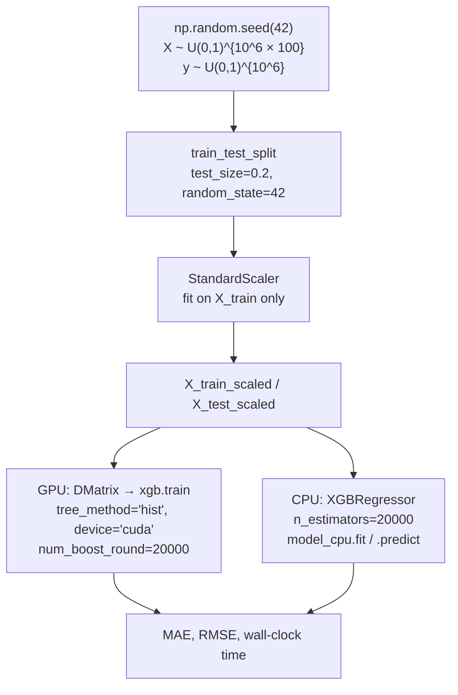

# XGBoost: Mathematical Foundations & Python Implementation

**Languages:** English | [فارسی](README.fa.md)

[](https://www.python.org/)
[](https://xgboost.readthedocs.io/)
[](https://github.com/azomorodian/MLXGB_CPU_GPU)
[](https://github.com/azomorodian/MLXGB_CPU_GPU)

**Author:** [Artin Zomorodian](https://github.com/azomorodian) (آرتین زمردیان) · GitHub: [`azomorodian`](https://github.com/azomorodian)

**Repository:** [`azomorodian/MLXGB_CPU_GPU`](https://github.com/azomorodian/MLXGB_CPU_GPU)

**Tech stack:** Python · XGBoost · Scikit-Learn · Pandas · NumPy · Matplotlib / Seaborn

---

A publication-oriented educational repository on **Extreme Gradient Boosting (XGBoost)**: the regularized second-order objective of Chen & Guestrin (2016), the greedy split-gain criterion, and a high-throughput **CPU vs CUDA GPU** Python pipeline.

The executable experiment in [`XGBoost_DigitClassifier.py`](XGBoost_DigitClassifier.py) is a **large-scale supervised regression benchmark** (one million rows, 100 features, 20,000 boosting rounds). XGBoost itself is loss-agnostic: the same additive-tree machinery underlies both `XGBRegressor` and `XGBClassifier`. The theory sections therefore cover the general framework, including the logistic / softmax classification path, while the code walkthrough matches this repository **line for line**.

> **Scientific note on the source filename.** The script is named `XGBoost_DigitClassifier.py` for historical reasons. The current implementation does **not** load MNIST (or any digit dataset) and does **not** call `XGBClassifier`. It draws i.i.d. Uniform$(0,1)$ features and labels, trains a GPU booster via `xgb.train` and a CPU booster via `XGBRegressor`, and reports **MAE**, **RMSE**, and wall-clock time.

---

## Table of Contents

1. [Overview](#1-overview)
2. [Theoretical & Mathematical Foundations of XGBoost](#2-theoretical--mathematical-foundations-of-xgboost)
   - [Gradient Tree Boosting vs. AdaBoost and Random Forests](#21-gradient-tree-boosting-vs-adaboost-and-random-forests)
   - [Objective Function Formulation](#22-objective-function-formulation)
   - [Second-Order Taylor Expansion](#23-second-order-taylor-expansion)
   - [Optimal Leaf Weight and Split Gain](#24-optimal-leaf-weight-and-split-gain)
   - [Regularization and Shrinkage](#25-regularization-and-shrinkage)
   - [Classification vs. Regression Losses](#26-classification-vs-regression-losses)
3. [Line-by-Line Code & Architecture Breakdown](#3-line-by-line-code--architecture-breakdown)
4. [Model Evaluation & Visualization](#4-model-evaluation--visualization)
5. [Getting Started & Execution Guide](#5-getting-started--execution-guide)
6. [Academic References & Bibliography](#6-academic-references--bibliography)

---

## 1. Overview

This repository is designed as a **teaching artifact**: it pairs the closed-form leaf-weight solution of XGBoost with a concrete, inspectable Python script that stresses both the sklearn-style estimator API and the native `DMatrix` / `xgb.train` API on CUDA.

| Component | What this repository actually does |
| --- | --- |
| **Learning problem** | Supervised **regression** on synthetic tabular data |
| **Design matrix** | `X = np.random.rand(1_000_000, 100)` — Uniform$(0,1)$, shape $(n, p) = (10^6, 100)$ |
| **Target** | `y = np.random.rand(1_000_000)` — drawn **independently** of `X` (pure noise; see §4) |
| **Split** | `train_test_split(..., test_size=0.2, random_state=42)` → 800,000 / 200,000 |
| **Preprocessing** | `StandardScaler` fitted on the training fold only |
| **GPU path** | `xgb.DMatrix` + `xgb.train(params_gpu, ..., num_boost_round=20000)` with `tree_method='hist'`, `device='cuda'` |
| **CPU path** | `XGBRegressor(n_estimators=20000)` + `.fit` / `.predict` |
| **Metrics** | Training / prediction wall time, Train/Test **MAE**, Train/Test **RMSE** |



**Why the labels contain no signal.** Because `y` is sampled independently of `X`, the Bayes-optimal predictor is the constant $\mathbb{E}[y] = 1/2$. The experiment is therefore a **systems / throughput benchmark** (how fast can 20,000 histogram trees be grown on $10^6 \times 100$ data), not a study of generalization to a structured target. Test MAE is expected to remain near the irreducible error of Uniform$(0,1)$, while train error can collapse toward zero as the ensemble memorizes noise — a live demonstration of **overfitting** under an overly large `n_estimators`.

---

## 2. Theoretical & Mathematical Foundations of XGBoost

XGBoost (eXtreme Gradient Boosting) is a **regularized, second-order, greedy additive-tree** algorithm. It implements Friedman’s Gradient Boosting Machine (2001) with three engineering and statistical upgrades that made it the default tabular learner of the 2010s:

1. A **second-order (Newton) expansion** of the loss, so each tree fits a quadratic approximation rather than a first-order pseudo-residual.
2. An **explicit complexity penalty** $\Omega(f)$ on the number of leaves and the $\ell_2$ (and optionally $\ell_1$) norm of leaf weights.
3. Systems optimizations — histogram binning (`hist`), sparsity-aware split finding, cache-aware block layout, and, in this repository, **CUDA device training**.

### 2.1 Gradient Tree Boosting vs. AdaBoost and Random Forests

Ensemble methods differ in *how* they reduce error. Russell & Norvig frame this as a search in hypothesis space: bagging explores *in parallel* by randomizing the training set; boosting explores *sequentially* by reweighting the residual of the current committee.

| | **Random Forest** (bagging) | **AdaBoost** (first-order boosting) | **XGBoost / GBM** (functional gradient descent) |
| --- | --- | --- | --- |
| **Hypothesis combination** | Average (or vote) of deep, independently grown trees | Weighted vote of weak stumps; example weights $w_i \propto \exp(-y_i F(x_i))$ | Additive model $F_T(x) = \sum_{t=1}^{T} \eta f_t(x)$; each $f_t$ is a CART |
| **What is optimized** | Variance of high-variance trees (Breiman) | Exponential loss $\sum_i \exp(-y_i F(x_i))$ | Arbitrary twice-differentiable loss $l(y, \hat{y})$ + $\Omega(f)$ |
| **Residual signal** | None — trees are i.i.d. given bootstrap/feature noise | Misclassified points receive larger *instance weights* | Each tree is fit to **gradients** $g_i$ (and **Hessians** $h_i$) of the current loss |
| **Regularization** | Depth, `min_samples_leaf`, feature bagging | Number of rounds; prone to noise sensitivity | $\gamma, \lambda, \alpha$, shrinkage $\eta$, row/column subsampling, max depth |
| **Parallelism** | Embarrassingly parallel over trees | Sequential over rounds | Sequential over rounds; **parallel over features / histogram bins** (and GPU) |

**AdaBoost** is boosting with exponential loss and a first-order (gradient) step. **Random Forests** reduce variance by decorrelating trees; they do not attack bias sequentially. **XGBoost** performs Newton steps in function space: the split criterion is the exact reduction in the *regularized second-order objective*, not Gini or entropy. That is why a shallow tree (`max_depth` 3–8) plus many rounds (`n_estimators` in the hundreds) is the typical XGBoost configuration, whereas a Random Forest prefers deeper trees and no shrinkage.

The additive model at iteration $t$ is

$$
\hat{y}_i^{(t)} = \hat{y}_i^{(t-1)} + \eta f_t(x_i), \qquad f_t \in \mathcal{F},
$$

where $\mathcal{F}$ is the space of regression trees and $\eta$ is the learning-rate / shrinkage factor (default $0.3$ in XGBoost; see §2.5).

### 2.2 Objective Function Formulation

Let $\{(x_i, y_i)\}_{i=1}^{n}$ be the training sample. Chen & Guestrin (2016) write the **regularized objective at boosting round $t$** as

$$
\mathcal{L}^{(t)} = \sum_{i=1}^{n} l\!\left(y_i,\; \hat{y}_i^{(t-1)} + f_t(x_i)\right) + \Omega(f_t),
$$

with the tree-complexity regularizer

$$
\Omega(f) = \gamma T + \frac{1}{2}\lambda \sum_{j=1}^{T} w_j^2.
$$

**Notation.**

| Symbol | Meaning in this repository |
| --- | --- |
| $l(\cdot,\cdot)$ | Per-instance loss. Default for `XGBRegressor` / `xgb.train` without `objective` is **squared error** |
| $\hat{y}_i^{(t-1)}$ | Score of the ensemble *before* tree $t$ (margin / raw prediction) |
| $f_t$ | The tree added at round $t$: a partition $q:\mathbb{R}^p\to\{1,\ldots,T\}$ and leaf weights $w \in \mathbb{R}^{T}$ |
| $T$ | Number of **leaves** (not boosting rounds). In code, `num_boost_round` / `n_estimators` is the number of *trees* |
| $\gamma$ | Minimum loss reduction required to make a split (`gamma` in the sklearn API) |
| $\lambda$ | $\ell_2$ penalty on leaf weights (`reg_lambda`; default $1$) |
| $w_j$ | Weight (prediction) of leaf $j$ |

An optional $\ell_1$ term $\alpha \sum_j |w_j|$ (`reg_alpha`) yields a soft-thresholded leaf weight, analogous to Lasso. This script does not set `reg_alpha`, so the $\ell_2$ form above is the one that is actually optimized.

### 2.3 Second-Order Taylor Expansion

The loss is in general a nonlinear function of $f_t(x_i)$. XGBoost replaces it by its **second-order Taylor polynomial** in the increment $f_t(x_i)$, evaluated at the current prediction $\hat{y}_i^{(t-1)}$:

$$
l\!\left(y_i,\; \hat{y}_i^{(t-1)} + f_t(x_i)\right)
\;\approx\;
l\!\left(y_i,\; \hat{y}_i^{(t-1)}\right)
\;+\;
g_i\, f_t(x_i)
\;+\;
\frac{1}{2}\, h_i\, f_t(x_i)^2.
$$

The **first-order gradient** and **second-order Hessian** (with respect to the *prediction*, not the parameters) are

$$
g_i = \frac{\partial l(y_i, \hat{y}_i^{(t-1)})}{\partial \hat{y}_i^{(t-1)}}, \qquad
h_i = \frac{\partial^2 l(y_i, \hat{y}_i^{(t-1)})}{\partial (\hat{y}_i^{(t-1)})^2}.
$$

The constant term $\sum_i l(y_i, \hat{y}_i^{(t-1)})$ does not depend on $f_t$ and can be dropped. Substituting $f_t(x) = w_{q(x)}$ and grouping instances by leaf $I_j = \{i : q(x_i) = j\}$ produces the **leaf-separable quadratic**

$$
\tilde{\mathcal{L}}^{(t)}(q, w)
=
\sum_{j=1}^{T}
\left[
G_j w_j + \frac{1}{2}\,(H_j + \lambda)\, w_j^2
\right]
+ \gamma T,
$$

where the sufficient statistics of leaf $j$ are

$$
G_j = \sum_{i \in I_j} g_i, \qquad H_j = \sum_{i \in I_j} h_i.
$$

This is why XGBoost is a **Newton method in function space**: $G_j$ is the summed gradient, $H_j$ is the summed curvature, and $\lambda$ is a ridge damping term that keeps the Newton step well-conditioned when $H_j$ is small (a common situation in logistic loss, where $h_i = p_i(1-p_i)$ vanishes for confident predictions).

**Worked Hessians for the two canonical losses.**

- **Squared error** (this repository’s implicit objective):
  $l = \tfrac{1}{2}(y_i - \hat{y}_i)^2$ gives $g_i = \hat{y}_i - y_i$ and $h_i = 1$. Every instance has the same curvature; $H_j = |I_j|$.
- **Logistic / binary log-loss** (`XGBClassifier`, `objective='binary:logistic'`):
  $p_i = \sigma(\hat{y}_i)$, $g_i = p_i - y_i$, $h_i = p_i(1-p_i)$.
- **Multiclass softmax** (`objective='multi:softprob'`): one tree is grown **per class per round**; gradients are $p_{i,k} - \mathbb{1}[y_i=k]$.

### 2.4 Optimal Leaf Weight and Split Gain

For a *fixed* tree structure $q$, $\tilde{\mathcal{L}}^{(t)}$ is a strictly convex quadratic in each $w_j$ (assuming $H_j + \lambda > 0$). Completing the square, or setting $\partial/\partial w_j = 0$, yields the **optimal leaf weight**

$$
w_j^{*} = -\frac{G_j}{H_j + \lambda}.
$$

Interpretation: the leaf predicts a **ridge-regularized Newton step** — minus the mean gradient, scaled by the mean Hessian plus $\lambda$. Substituting $w_j^{*}$ back into the objective gives the **structure score**

$$
\tilde{\mathcal{L}}^{(t)}(q)
=
-\frac{1}{2} \sum_{j=1}^{T} \frac{G_j^2}{H_j + \lambda} + \gamma T.
$$

A candidate split of a parent leaf into left/right children is accepted according to the **gain** (similarity-score reduction)

$$
\mathrm{Gain}
=
\frac{1}{2}
\left[
\frac{G_L^2}{H_L+\lambda}
+
\frac{G_R^2}{H_R+\lambda}
-
\frac{(G_L+G_R)^2}{H_L+H_R+\lambda}
\right]
- \gamma.
$$

The three fractions are the **similarity scores** of the left child, the right child, and the unsplit parent. A split is kept only if $\mathrm{Gain} > 0$, i.e. only if the loss reduction exceeds the leaf penalty $\gamma$. This is exactly the role of the hyperparameter `gamma` in `XGBClassifier` / `XGBRegressor`.

In the histogram (`hist`) algorithm used here (`tree_method='hist'`), features are bucketed into discrete bins and the best threshold is searched over bin boundaries rather than over every unique value — the approximation that makes $n = 10^6$ and `num_boost_round=20000` computationally feasible, especially on GPU.

### 2.5 Regularization and Shrinkage

Overfitting control in XGBoost is **layered**. The following knobs all appear in the sklearn API; this script currently sets only the round count and the GPU device, leaving the rest at library defaults.

| Mechanism | Symbol / API | Role |
| --- | --- | --- |
| **Shrinkage (learning rate)** | $\eta$ · `learning_rate` (default $0.3$) | After $w_j^{*}$ is computed, the tree is added as $\eta f_t$. Small $\eta$ (e.g. $0.03$–$0.1$) with more rounds is the standard recipe against overshooting the Newton step |
| **$\ell_2$ (Ridge) on leaves** | $\lambda$ · `reg_lambda` (default $1$) | Inflates the denominator $H_j+\lambda$, shrinking $\|w_j^{*}\|$ toward $0$ |
| **$\ell_1$ (Lasso) on leaves** | $\alpha$ · `reg_alpha` (default $0$) | Soft-thresholds $w_j^{*}$; induces sparsity in leaf values |
| **Minimum split gain** | $\gamma$ · `gamma` (default $0$) | Subtracted from Gain; prunes statistically weak splits |
| **Tree depth** | `max_depth` (default $6$) | Caps interaction order; the dominant capacity control together with $\eta$ |
| **Row subsampling** | `subsample` (default $1$) | Stochastic GBM: each round sees a random fraction of rows (Friedman 2002) |
| **Column subsampling** | `colsample_bytree` / `bylevel` / `bynode` | Feature bagging à la Random Forests; reduces column-wise correlation of trees |
| **Histogram device** | `tree_method='hist'`, `device='cuda'` | Not a statistical regularizer, but changes the split-search approximation and the hardware path |

**Column subsampling** is particularly important when $p$ is large or features are collinear: each tree is forced to specialize on a random view of the feature space, which is a variance-reduction device analogous to Random Forest’s `max_features`.

**Methodological caveat for this script.** `params_gpu` sets only `tree_method` and `device`. `XGBRegressor(n_estimators=20000)` on CPU likewise leaves `max_depth`, `learning_rate`, `subsample`, `colsample_bytree`, `gamma`, and `reg_lambda` at defaults. The CPU vs GPU comparison is therefore a **runtime comparison of two API surfaces under default hyperparameters**, not a fully factorial ablation of every regularizer.

### 2.6 Classification vs. Regression Losses

The algebra of §2.2–§2.4 does not mention $y_i \in \{0,1\}$ versus $y_i \in \mathbb{R}$. Only the definitions of $g_i$ and $h_i$ change.

| Task | XGBoost estimator | Typical `objective` | Evaluation (see §4) |
| --- | --- | --- | --- |
| **Regression (this repo)** | `XGBRegressor` / `xgb.train` | `reg:squarederror` | MAE, RMSE |
| **Binary classification** | `XGBClassifier` | `binary:logistic` | Accuracy, log-loss, ROC-AUC, PR-AUC, confusion matrix |
| **Multiclass (e.g. digits)** | `XGBClassifier` | `multi:softprob` | Accuracy, macro-F1, confusion matrix, one-vs-rest AUC |

To turn this repository into a genuine digit classifier one would replace the synthetic draw with a labeled image/tabular dataset, set `objective='multi:softprob'`, and evaluate with `accuracy_score`, `log_loss`, `roc_auc_score`, and `classification_report`. The boosting mathematics would be unchanged.

---

## 3. Line-by-Line Code & Architecture Breakdown

All executable logic lives in [`XGBoost_DigitClassifier.py`](XGBoost_DigitClassifier.py) (75 lines). [`main.py`](main.py) is the default PyCharm stub (`print_hi('PyCharm')`) and is **not** part of the learning pipeline.

### 3.1 Imports (lines 1–7)

```python
import numpy as np
import pandas as pd
from sklearn.model_selection import train_test_split
from sklearn.preprocessing import StandardScaler
from sklearn.metrics import mean_absolute_error, mean_squared_error
import time
import xgboost as xgb
```

| Line | Object | Role |
| --- | --- | --- |
| 1 | `numpy as np` | Synthetic data generation and the backing arrays of every later call |
| 2 | `pandas as pd` | Imported but **never referenced**. Harmless; retained for a DataFrame-oriented extension (named columns, `feature_importances_` plots) |
| 3 | `train_test_split` | i.i.d. hold-out split with a fixed seed |
| 4 | `StandardScaler` | Column-wise $z$-score: $(x - \hat{\mu}_{\mathrm{train}}) / \hat{\sigma}_{\mathrm{train}}$ |
| 5 | `mean_absolute_error`, `mean_squared_error` | MAE and RMSE (the latter via `squared=False`) |
| 6 | `time` | Wall-clock `time.time()` around `train` / `fit` / `predict` |
| 7 | `xgboost as xgb` | Native API: `xgb.DMatrix`, `xgb.train` |

### 3.2 Synthetic dataset (lines 9–12)

```python
np.random.seed(42)
X = np.random.rand(1000000, 100)
y = np.random.rand(1000000)
```

- `np.random.seed(42)` pins the NumPy RNG so `X`, `y`, and (together with `random_state=42` in the splitter) the train/test partition are reproducible.
- `X` has **1,000,000 rows and 100 columns**, i.i.d. Uniform$(0,1)$. In memory this is $10^6 \times 100 \times 8$ bytes $\approx$ **800 MB** for `float64`, plus a second copy after scaling, plus DMatrix overhead — plan for several GB of RAM.
- `y` is a **1-D** Uniform$(0,1)$ vector of length $10^6$, drawn **independently** of `X`. There is no $f(X)$ to recover; any train-error improvement beyond the constant predictor is memorization.

### 3.3 Train–test split (lines 14–15)

```python
X_train, X_test, y_train, y_test = train_test_split(X, y, test_size=0.2, random_state=42)
```

- `test_size=0.2` → $|\mathcal{D}_{\mathrm{train}}| = 800{,}000$, $|\mathcal{D}_{\mathrm{test}}| = 200{,}000$.
- `random_state=42` makes the permutation deterministic.
- Stratification is neither requested nor appropriate: `y` is continuous.

Variable names used downstream: `X_train`, `X_test`, `y_train`, `y_test`.

### 3.4 Standard scaling (lines 17–20)

```python
scaler = StandardScaler()
X_train_scaled = scaler.fit_transform(X_train)
X_test_scaled = scaler.transform(X_test)
```

Trees are **invariant to monotone column rescaling**, so `StandardScaler` does not change the XGBoost split geometry. It *does* change the numerical range seen by the histogram builder and is pedagogically correct (fit on train, transform test — no leakage). The scaled arrays `X_train_scaled` and `X_test_scaled` are the only feature matrices passed to XGBoost.

### 3.5 GPU booster: parameters, DMatrix, `xgb.train` (lines 22–34)

```python
params_gpu = {
    'tree_method': 'hist',
    'device': 'cuda',
}

dtrain_gpu = xgb.DMatrix(X_train_scaled, label=y_train)
dtest_gpu = xgb.DMatrix(X_test_scaled, label=y_test)

start_time = time.time()
model_gpu = xgb.train(params_gpu, dtrain_gpu, num_boost_round=20000)
gpu_train_time = time.time() - start_time
```

| Name | Meaning |
| --- | --- |
| `params_gpu` | Native-parameter dict. `'tree_method': 'hist'` selects the quantile-histogram split finder. `'device': 'cuda'` is the **XGBoost ≥ 2.0** way to place the histogram builder on the GPU (this replaces the older `gpu_hist` alias) |
| `dtrain_gpu`, `dtest_gpu` | `xgb.DMatrix` is XGBoost’s internal columnar format (compressed, cache-aware, GPU-resident after the first call). Labels travel with the matrix via `label=` |
| `num_boost_round=20000` | Number of additive trees $T_{\mathrm{boost}}$ — equivalent to sklearn’s `n_estimators` |
| `model_gpu` | A native `Booster` object, **not** an sklearn estimator |
| `gpu_train_time` | Seconds for 20,000 rounds on CUDA |

**Hardware prerequisite.** `device='cuda'` requires an NVIDIA GPU, a working CUDA driver, and an XGBoost build compiled with GPU support. On a CPU-only machine this block raises. See §5.

**Default objective.** Because `params_gpu` does not set `'objective'`, XGBoost uses `reg:squarederror`. Predictions are real-valued scores, matching the regression metrics that follow.

### 3.6 GPU inference and evaluation (lines 36–51)

```python
start_time = time.time()
train_pred_gpu = model_gpu.predict(dtrain_gpu)
test_pred_gpu = model_gpu.predict(dtest_gpu)
gpu_pred_time = time.time() - start_time

train_mae_gpu = mean_absolute_error(y_train, train_pred_gpu)
test_mae_gpu = mean_absolute_error(y_test, test_pred_gpu)
train_rmse_gpu = mean_squared_error(y_train, train_pred_gpu, squared=False)
test_rmse_gpu = mean_squared_error(y_test, test_pred_gpu, squared=False)
```

- `Booster.predict` on a `DMatrix` returns a NumPy vector of $\hat{y}$. There is no `predict_proba` on the native regressor path; that method exists on `XGBClassifier`.
- `squared=False` asks sklearn for RMSE rather than MSE. This keyword is valid in scikit-learn **&lt; 1.6**; newer releases prefer `root_mean_squared_error`. The `requirements.txt` in this repository caps sklearn below 1.6 so the script runs as written.
- Printed fields: `gpu_train_time`, `gpu_pred_time`, `train_mae_gpu`, `test_mae_gpu`, `train_rmse_gpu`, `test_rmse_gpu`.

### 3.7 CPU booster: `XGBRegressor` (lines 53–75)

```python
from xgboost import XGBRegressor
model_cpu = XGBRegressor(n_estimators=20000)

start_time = time.time()
model_cpu.fit(X_train_scaled, y_train)
cpu_train_time = time.time() - start_time

start_time = time.time()
train_pred_cpu = model_cpu.predict(X_train_scaled)
test_pred_cpu = model_cpu.predict(X_test_scaled)
cpu_pred_time = time.time() - start_time
```

This is the **sklearn-compatible estimator API**:

| Call | Role |
| --- | --- |
| `XGBRegressor(...)` | Instantiation. Only `n_estimators=20000` is overridden |
| `model_cpu.fit(X_train_scaled, y_train)` | Training; accepts NumPy arrays (no `DMatrix` required) |
| `model_cpu.predict(...)` | Inference; analog of `Booster.predict` |

Evaluation mirrors the GPU block with `train_mae_cpu`, `test_mae_cpu`, `train_rmse_cpu`, `test_rmse_cpu`, `cpu_train_time`, and `cpu_pred_time`.

**Fairness of the CPU/GPU comparison.** The two paths are *intentionally* the two public APIs, but they are not a perfectly controlled A/B test:

1. GPU uses the native `Booster`; CPU uses the sklearn wrapper (extra Python overhead per call, different default thread occupancy).
2. Only the GPU dict sets `tree_method='hist'` and `device='cuda'`. The CPU estimator uses XGBoost’s current sklearn defaults (`hist` on recent versions, CPU device).
3. Both use 20,000 rounds, the same scaled matrices, and the same metrics — so **wall-clock time** is the scientifically meaningful contrast.

### 3.8 Core hyperparameters (settable; mostly defaults here)

These names are the sklearn / XGBoost API surface you will tune in any serious study. In *this* file only `n_estimators` / `num_boost_round` and the GPU device are set.

| Hyperparameter | In this script | Default (XGBoost) | Effect |
| --- | --- | --- | --- |
| `n_estimators` / `num_boost_round` | **20000** | 100 | Number of trees $T_{\mathrm{boost}}$. Extremely large here; primary driver of runtime and of train-set overfitting on noise |
| `max_depth` | unset | 6 | Maximum tree depth; interaction order |
| `learning_rate` ($\eta$) | unset | 0.3 | Shrinkage applied to each $f_t$ |
| `subsample` | unset | 1.0 | Row subsample per tree |
| `colsample_bytree` | unset | 1.0 | Column subsample per tree |
| `gamma` ($\gamma$) | unset | 0 | Minimum Gain to split |
| `reg_lambda` ($\lambda$) | unset | 1 | $\ell_2$ leaf penalty |
| `tree_method` | **`'hist'`** (GPU dict only) | `hist` (recent XGBoost) | Histogram vs. exact greedy |
| `device` | **`'cuda'`** (GPU dict only) | `cpu` | Placement of histogram + predict |

A research-grade follow-up would wrap both estimators in the same `param` dict (`max_depth`, `eta`, `subsample`, `colsample_bytree`, `gamma`, `reg_lambda`) and would add `early_stopping_rounds` on a validation `DMatrix` so 20,000 rounds are an *upper bound*, not a mandate.

---

## 4. Model Evaluation & Visualization

### 4.1 Metrics actually computed

The script prints eight quality numbers plus four timings.

**Mean Absolute Error**

$$
\mathrm{MAE} = \frac{1}{n}\sum_{i=1}^{n} \lvert y_i - \hat{y}_i \rvert
$$

implemented as `mean_absolute_error(y_*, *_pred_*)`. MAE is in the same units as $y$ (here, the unit interval) and is robust to large residuals.

**Root Mean Squared Error**

$$
\mathrm{RMSE} = \sqrt{\frac{1}{n}\sum_{i=1}^{n} (y_i - \hat{y}_i)^2}
$$

implemented as `mean_squared_error(..., squared=False)`. RMSE penalizes large mistakes more than MAE; the gap $\mathrm{RMSE}-\mathrm{MAE}$ is a rough indicator of residual tail weight.

**Irreducible-error baselines for this synthetic $y \sim U(0,1)$.**  
If the model outputs the Bayes predictor $\hat{y} \equiv 1/2$:

- $\mathrm{MAE} = \mathbb{E}[|U-1/2|] = 1/4 = 0.25$
- $\mathrm{RMSE} = \sqrt{\mathrm{Var}(U)} = 1/\sqrt{12} \approx 0.2887$

**What you should observe.**

| Quantity | Expected behaviour with 20,000 trees on *noise* |
| --- | --- |
| `train_mae_*`, `train_rmse_*` | Can fall **well below** 0.25 / 0.289 as the ensemble interpolates the training labels |
| `test_mae_*`, `test_rmse_*` | Should stay **near** 0.25 / 0.289 (or worsen if the model overfits aggressively) |
| `gpu_train_time` vs `cpu_train_time` | The headline systems result; GPU histogram training is typically much faster at this scale, provided CUDA is available |
| `gpu_pred_time` vs `cpu_pred_time` | Inference is cheaper than training; the ratio still reflects device bandwidth |

This train/test *gap* is the empirical signature of overfitting — the practical counterpart of setting $\Omega(f)$ and $\eta$ too weakly relative to $T_{\mathrm{boost}}$.

### 4.2 Classification metrics (educational; not executed here)

If the same booster were trained with a categorical $y$ (`XGBClassifier` / `objective='binary:logistic'` or `'multi:softprob'`), the standard report would be:

| Metric | Definition | sklearn |
| --- | --- | --- |
| **Accuracy** | $\frac{1}{n}\sum_i \mathbb{1}[\hat{y}_i = y_i]$ | `accuracy_score` |
| **Log-loss** | $-\frac{1}{n}\sum_i \sum_k y_{ik}\log \hat{p}_{ik}$ — the proper scoring rule that XGBoost itself minimizes under logistic/softmax | `log_loss` |
| **ROC-AUC** | Probability that a random positive ranks above a random negative; threshold-invariant | `roc_auc_score` (binary or `ovr` / `ovo` for multiclass) |
| **Confusion matrix** | Counts of TP/FP/FN/TN (or $K \times K$ for $K$ classes) | `confusion_matrix` |
| **Classification report** | Per-class precision, recall, F1, support | `classification_report` |

Inference APIs:

- `predict` → hard labels (argmax of class scores).
- `predict_proba` → $\hat{p}(y \mid x)$ after the logistic / softmax link. **This method is not called in the present regression script.**

### 4.3 Feature importance: Weight, Cover, and Gain

A trained `Booster` (including `model_gpu` and `model_cpu.get_booster()`) exposes three importance semantics via `get_score(importance_type=...)` or `plot_importance`:

| Type | Definition | When it is informative |
| --- | --- | --- |
| **Weight** (frequency) | Number of times a feature is used for a split | High-cardinality features can look “important” merely because they offer more cut points |
| **Cover** | Sum of Hessian $H$ over splits that use the feature (i.e. how many instances, curvature-weighted, the feature is responsible for) | Accounts for *how many* points a split affects |
| **Gain** | Total loss reduction $\sum \mathrm{Gain}$ attributed to splits on that feature | Usually the preferred scientific summary: it is the quantity §2.4 actually optimizes |

In **this** experiment every column of `X` is i.i.d. Uniform$(0,1)$ and independent of $y$, so all three importance vectors are **sampling noise**. Plotting them is still a useful sanity check: they should look roughly uniform, not spiked. Example (not in the script; requires Matplotlib):

```python
import matplotlib.pyplot as plt
from xgboost import plot_importance

plot_importance(model_gpu, importance_type="gain", max_num_features=20)
plt.tight_layout()
plt.show()
```

Seaborn residual diagnostics (also an extension, not in the script):

```python
import seaborn as sns
resid = y_test - test_pred_gpu
sns.histplot(resid, kde=True)
```

On this noise task the residual histogram should resemble $U(0,1) - \hat{y}_{\mathrm{test}}$, concentrated near the constant-predictor residual if the model has not overfit the test fold (it never sees those labels during `fit` / `train`).

---

## 5. Getting Started & Execution Guide

### 5.1 Prerequisites

- **Python 3.9+**
- **RAM:** several GB (two `float64` copies of a $10^6 \times 100$ matrix, plus DMatrix).
- **GPU path:** NVIDIA GPU, recent CUDA driver, and `xgboost` built with CUDA. The CPU path (`XGBRegressor`) runs without a GPU.
- **Time:** 20,000 rounds on $8 \times 10^5$ rows is a **heavy** job. For a smoke test, temporarily set `num_boost_round=50` and `n_estimators=50`.

```bash
python -m venv .venv

# Windows (PowerShell)
.venv\Scripts\Activate.ps1

# Linux / macOS
# source .venv/bin/activate

python -m pip install --upgrade pip
python -m pip install -r requirements.txt
```

`requirements.txt` pins `scikit-learn>=1.3,<1.6` so that `mean_squared_error(..., squared=False)` remains valid, and `xgboost>=2.0` so that `device='cuda'` is recognized.

### 5.2 Run from the command line

From the repository root:

```bash
python XGBoost_DigitClassifier.py
```

Expected stdout pattern (numeric values depend on hardware):

```
Training Time       : <gpu_train_time> seconds
Prediction Time     : <gpu_pred_time> seconds
Train MAE: ..., Test MAE: ...
Train RMSE: ..., Test RMSE: ...
Training Time       : <cpu_train_time> seconds
Prediction Time     : <cpu_pred_time> seconds
Train MAE: ..., Test MAE: ...
Train RMSE: ..., Test RMSE: ...
```

The first block is the **GPU** native booster; the second is the **CPU** `XGBRegressor`.

**CPU-only machines.** Comment out or skip lines 22–51 (`params_gpu` through the GPU printout) and run only the `XGBRegressor` section, or install a CUDA-enabled XGBoost and a compatible GPU.

### 5.3 Run in JupyterLab / Jupyter Notebook

```bash
python -m pip install jupyterlab
jupyter lab
```

Then either:

1. Open a new notebook and copy the cells from `XGBoost_DigitClassifier.py` in the same order (imports → data → split → scale → GPU train → GPU eval → CPU train → CPU eval), or
2. Execute the file from a notebook cell:

```python
%run XGBoost_DigitClassifier.py
```

Jupyter is convenient for adding `plot_importance`, ROC curves (classification extension), and Seaborn residual plots after the two models exist in memory as `model_gpu` and `model_cpu`.

### 5.4 Reproducibility

| Source of randomness | How it is pinned |
| --- | --- |
| Feature / label draw | `np.random.seed(42)` |
| Train/test permutation | `random_state=42` in `train_test_split` |
| XGBoost column/row sampling | library defaults (`subsample=1`, `colsample_bytree=1`) so no extra RNG; set `random_state=` on `XGBRegressor` if you later enable subsampling |

GPU floating-point reductions are not bit-identical to CPU reductions; expect **timing** differences by design and **metric** differences at floating-point noise level (and larger differences if the two APIs ever diverge in default `tree_method` / `max_bin`).

---

## 6. Academic References & Bibliography

1. Chen, T., & Guestrin, C. (2016). **XGBoost: A Scalable Tree Boosting System.** In *Proceedings of the 22nd ACM SIGKDD International Conference on Knowledge Discovery and Data Mining* (KDD ’16), pp. 785–794. ACM. [https://doi.org/10.1145/2939672.2939785](https://doi.org/10.1145/2939672.2939785)  
   *Primary source for $\mathcal{L}^{(t)}$, $\Omega(f)$, $w_j^{*}$, the Gain formula, sparsity-aware split finding, and the systems design (block structure, histogram, out-of-core, and — in later versions — GPU `hist`).*

2. Friedman, J. H. (2001). **Greedy Function Approximation: A Gradient Boosting Machine.** *Annals of Statistics, 29*(5), 1189–1232. [https://doi.org/10.1214/aos/1013203451](https://doi.org/10.1214/aos/1013203451)  
   *The functional-gradient view: boosting as steepest descent in $L^2$, stagewise additive modeling, and the connection to regression trees as base learners. XGBoost is a second-order, regularized realization of this program.*

3. Friedman, J. H. (2002). **Stochastic Gradient Boosting.** *Computational Statistics & Data Analysis, 38*(4), 367–378.  
   *Row subsampling (`subsample`) as a variance-reduction / regularization device — the ancestor of XGBoost’s stochastic row and column sampling.*

4. Freund, Y., & Schapire, R. E. (1997). **A Decision-Theoretic Generalization of On-Line Learning and an Application to Boosting.** *Journal of Computer and System Sciences, 55*(1), 119–139.  
   *AdaBoost; the exponential-loss, first-order counterpart discussed in §2.1.*

5. Breiman, L. (2001). **Random Forests.** *Machine Learning, 45*(1), 5–32.  
   *Variance reduction by bagging and random feature subspaces; contrast with sequential boosting.*

6. Russell, S., & Norvig, P. (2020). **Artificial Intelligence: A Modern Approach** (4th ed.). Pearson.  
   *Search in hypothesis space, inductive bias, ensemble methods as strategies for exploring the version space, and the bias–variance decomposition used throughout this README to interpret bagging vs. boosting.*

7. Natekin, A., & Knoll, A. (2013). **Gradient Boosting Machines: A Tutorial.** *Frontiers in Neurorobotics, 7*, 21.  
   *Accessible derivation of GBM as numerical optimization in function space.*

---

## Citation

If you use this educational implementation in coursework or a technical report, please cite the original XGBoost paper and credit the repository author:

```
Zomorodian, A. (2026). XGBoost: Mathematical Foundations & Python Implementation
(CPU vs GPU). GitHub repository. https://github.com/azomorodian/MLXGB_CPU_GPU
```

---

<div align="center">

**Artin Zomorodian** (آرتین زمردیان) · [`github.com/azomorodian`](https://github.com/azomorodian)

[English](README.md) · [فارسی](README.fa.md)

</div>
